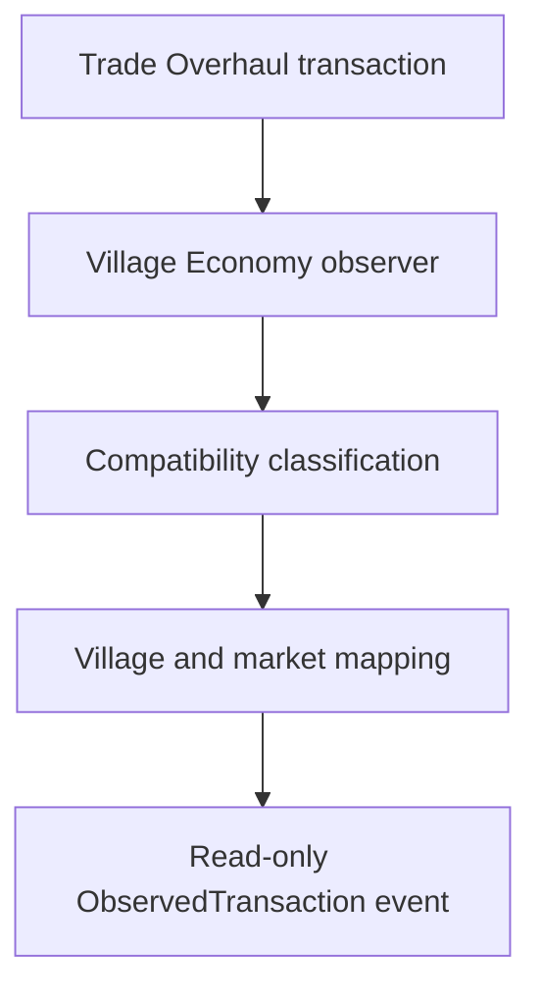

# Village Economy

Village Economy is a Fabric 1.20.1 addon designed to extend:

- Trade Overhaul
- Dynamic Villager Trades
- Numismatic Overhaul

Rather than replacing those mods, Village Economy gives every village its own local economy.

## Vision

Each village should feel alive.

Selling lots of bread in one village should lower its value there.
Mining towns should value ores differently from farming villages.
Villagers should slowly recover from market changes over time.

## Target Versions

- Minecraft 1.20.1
- Fabric Loader 0.19.3
- Java 17

## Current Status

The repository contains the buildable project foundation, configuration system, server-side
village tracking, persistent per-village market data, and an invisible supply-and-demand
simulation. It also contains the read-only trading compatibility foundation described below.
Completed Trade Overhaul transactions are now observed and mapped to their owning village market,
but they do not change that market or any player-facing gameplay.

## Required Trading Stack

Village Economy intentionally has no vanilla or optional-dependency fallback. These exact versions
were used to build and test the compatibility layer:

| Mod | Tested version | Responsibility |
| --- | --- | --- |
| Numismatic Overhaul | `0.2.18+1.20` | Owns player currency and the bronze/silver/gold coin items. |
| Trade Overhaul | `1.0.1` | Owns the trading interface, villager wallets, and configured prices. |
| Dynamic Villager Trades | `1.3.1` | Generates and may extend the final merchant offers. |

Fabric API and Cloth Config are also required. Mod Menu remains optional and only provides access
to the graphical configuration screen. Numismatic Overhaul's own required libraries, including
oωo, must be present as required by that mod.

Fabric Loader resolves dependency initialization order, so there is no manual jar ordering.
Install all required mods in the same `mods` directory. Fabric will stop with a missing-dependency
message if any required mod is absent.

### Compatibility Ownership

Village Economy observes each system without treating their storage as interchangeable:

- Numismatic Overhaul's player currency component is the authoritative player balance.
- Trade Overhaul's separate villager wallet is the authoritative villager balance.
- Trade Overhaul remains the authoritative trading UI and pricing configuration.
- Dynamic Villager Trades controls offer generation. Village Economy observes the final generated
  `MerchantOffer`, including its extended offer form, rather than registering competing offers.

Third-party calls are isolated under `dev.gumba21.villageeconomy.compat`. Market simulation,
persistence, and commands consume Village Economy-owned value objects instead of spreading
third-party types throughout the project.

### Normalized Monetary Values

`MarketValue` is an immutable non-negative `long` measured in the smallest Numismatic denomination:

```text
1 bronze = 1 base unit
1 silver = 100 base units
1 gold   = 10,000 base units
```

These ratios are verified against Numismatic Overhaul 0.2.18's `CurrencyResolver`. Addition,
subtraction, bounded rational multiplication, comparison, and clamping are overflow-safe.
Subtraction that would produce a negative value is rejected.

The existing market simulator still stores abstract double-valued prices. It does not treat those
numbers as literal coins. The single documented conversion boundary currently maps one market
price unit to 100 base units and uses deterministic HALF_UP rounding.

Currency decomposition and composition round-trip exactly, including large `long` values.
Materialized coin stacks are split at Numismatic Overhaul's 99-item stack size. Requests that would
require more than 4,096 stacks return an exact structured plan and reject direct materialization
instead of truncating the value.

### Read-only Trade Classification

The compatibility layer can copy and classify vanilla and Dynamic Villager Trades extended offers
as:

- player buys an item with recognized Numismatic coins
- player sells an item for recognized Numismatic coins
- currency exchange
- unknown or ambiguous

Emeralds and other arbitrary items are not silently treated as money. Mixed currency/item inputs,
multiple non-currency inputs, empty offers, and unsupported shapes become `UNKNOWN`; no price or
direction is fabricated. The compatibility layer also reads Trade Overhaul profession levels,
villager denomination balances, configured pricing information, and available offers without
modifying them.

This foundation does **not** alter villager prices, deduct or grant player currency, mutate
villager wallets, apply transactions to supply or demand, change restocking, register offers,
replace screens, or add networking.

## Read-Only Trade Observation

Village Economy observes Trade Overhaul 1.0.1's server-side
`handleBuyOnServer` and `handleSellOnServer` transaction methods. A small compatibility mixin takes
an immutable pre-execution snapshot at method entry and checks the final state when the method
returns. A transaction is accepted only when both the source item count and Numismatic player
balance moved in the expected directions. Preview, disabled, unaffordable, cancelled, and other
early-return paths have no matching deltas and emit nothing.

This also handles Trade Overhaul's bulk buttons correctly: quantity is the actual source-stack
delta and monetary value is the exact player-balance delta. A click is never assumed to represent
one item or one offer unit.



### Transaction and deduplication model

The immutable `ObservedTransaction` contains the game time, player and villager UUIDs, dimension,
villager position/profession/level, BUY or SELL direction, canonical item identifier, actual
quantity, exact `MarketValue`, stable village and market references, transaction source, and a
small execution snapshot. It stores no live `ItemStack`, `MerchantOffer`, entity, inventory,
component, or third-party object.

Every entry into an authoritative Trade Overhaul transaction method receives a monotonically
increasing execution token. The short-lived deduplication key combines that token with player,
villager, direction, item, quantity, and value. A duplicate callback for one execution is
suppressed, while rapid identical trades receive different tokens and remain separate. The cache
expires after 40 ticks, is capped at 2,048 entries, is memory-only, and stores no entity references.

### Ownership and market mapping

The villager's server-side dimension and position at completion are authoritative. A bounded
in-memory villager-membership cache is checked first, then the existing spatial village query is
used. Resolution never crosses dimensions, never uses the player's position, rejects unloaded
villages, respects the tracked village radius, and does not create a village because a trade
occurred.

The resolved village UUID performs an O(1) lookup of its existing market. Missing markets are
reported diagnostically; transaction observation does not create duplicates or run persistence
repair. The item is mapped only when that exact registry identifier is already tracked by the
village market.

Ordinary and modded items use their canonical registry identifier when explicitly tracked.
Damage and cosmetic names do not change that identifier. Enchanted items, enchanted books, filled
maps, potions, and items with identity-bearing custom NBT are retained in diagnostics but excluded
from valid market events because their economic identity cannot safely be represented by the
current item-ID-only market model. Untracked unusual items are not automatically added.

### Events, diagnostics, and failure isolation

Valid observations are published synchronously on the server thread through
`ObservedTransactionListener`. Listener exceptions are isolated and rate-limited so one listener
cannot stop a trade or block later listeners. The default behavior only records diagnostics; it
does not connect transactions to the simulator.

The newest 100 diagnostic results and their counters are held in memory per server. They are not
written to world data and are cleared at full server shutdown. If observation fails after Trade
Overhaul has committed a transaction, gameplay fails open: the trade remains complete, no normal
market event is published, no market mutation occurs, and a bounded diagnostic failure is kept
where possible.

The next planned integration stage may consume these immutable events to affect supply and demand.
That connection is intentionally outside this change.

## Configuration

Village Economy loads its server-safe configuration during mod initialization. The file is stored
at `config/villageeconomy.json` and is created automatically when it does not exist:

```json
{
  "enabled": true,
  "debugLogging": false,
  "villageDetectionRadius": 64,
  "marketUpdateIntervalTicks": 1200,
  "priceChangeStrength": 0.15,
  "minimumPriceMultiplier": 0.5,
  "maximumPriceMultiplier": 2.0,
  "recoveryRate": 0.02
}
```

| Setting | Default | Valid range | Description |
| --- | ---: | ---: | --- |
| `enabled` | `true` | `true` / `false` | Master switch for village tracking and future systems. |
| `debugLogging` | `false` | `true` / `false` | Enables additional diagnostic logging. |
| `villageDetectionRadius` | `64` | `1`–`512` | Radius used to group and match loaded village records. |
| `marketUpdateIntervalTicks` | `1200` | `20`–`1728000` | Ticks between village scans and market simulation updates. |
| `priceChangeStrength` | `0.15` | `0.0`–`1.0` | Controls how quickly prices approach their calculated target. |
| `minimumPriceMultiplier` | `0.5` | `0.01`–`1.0` | Lowest multiplier market calculations may apply. |
| `maximumPriceMultiplier` | `2.0` | `1.0`–`10.0` | Highest multiplier market calculations may apply. |
| `recoveryRate` | `0.02` | `0.0`–`1.0` | Controls normalization toward equilibrium and base prices. |

Every setting is validated when loaded or saved. Missing, incorrectly typed, non-finite, fractional
integer, and out-of-range values are replaced with their defaults and the repaired file is written
back to disk. If the JSON is malformed, the original file is moved to a timestamped
`villageeconomy.json.malformed-*.bak` file and a valid default configuration is generated. If a
filesystem error prevents recovery, the mod continues with safe in-memory defaults instead of
crashing Minecraft. Each load outcome is logged as loaded, created, repaired, reset, or an
in-memory fallback.

With Mod Menu installed, every setting is available through a Cloth Config screen with its valid
range and description. Saving the screen writes the file and applies the values immediately; no
Minecraft restart or config reload is required. Dedicated server administrators can edit the JSON
file directly and restart the server to load those external edits.

## Village Tracking

Village tracking runs only on the logical server, including the integrated server used by
singleplayer. It never registers a client tick or runs village logic in a client-only context.

At startup, Village Economy loads its tracked-village state. While `enabled` is `true`, the central
`VillageManager` scans once immediately and then every `marketUpdateIntervalTicks`. Each scan:

1. Visits each loaded dimension without loading or generating chunks.
2. Reads loaded villager entities once and asks vanilla whether their positions are part of a
   village.
3. Groups nearby villagers using `villageDetectionRadius`, counts their distinct assigned job
   sites, and caches their profession mix for market simulation.
4. Matches groups to existing records by dimension and distance, preserving stable UUIDs.
5. Reconciles loaded state from all chunks intersecting the detection radius, loaded villagers
   in that area, and nearby players without force-loading chunks.
6. Requires two consecutive scans with no active evidence before marking a village unloaded;
   one transient scan miss never clears the loaded state.

Each record stores its stable UUID, center, dimension, detection radius, discovery and last-seen
timestamps, villager, workstation, and profession counts, and current loaded state. The manager
also supports containing-village and nearest-village queries for later features. The cached
observations avoid a second entity scan during market simulation.

With `debugLogging=true`, actual loaded-state transitions and rejected transient unloads include
the village UUID, reason, tracked and currently loaded villager counts, relevant loaded chunk
count, and nearby player count.

## Market Foundation

Every tracked village owns exactly one `MarketState`, keyed by the village's stable UUID for O(1)
lookup. A market stores its village UUID, creation time, last-update time, and an item-keyed
collection of `MarketEntry` objects. Each entry stores:

- Minecraft item identifier
- base and current price
- minimum and maximum price multiplier
- supply and demand values
- last-modified time

Newly discovered villages receive a market immediately. When an existing world loads, the
`MarketManager` restores saved markets and creates any missing market automatically. Its public API
supports getting, creating, removing, checking, and resetting a village market, plus retrieving an
item's current price. Creating a market twice returns the existing instance rather than producing
duplicates.

There is still no trade interception, buying, selling, restocking, merchant behavior, or
player-facing effect. The simulation changes only persisted internal market values.

## Market Simulation

After each server-side village scan, `MarketSimulator` processes every tracked market once. This
uses the same `marketUpdateIntervalTicks` schedule, so no economy work runs every tick. The
permission-level-2 simulation command can request exactly one additional update without changing
the normal schedule.

Loaded villages use their latest observable population, workstation, detection-radius, and cached
profession counts. Unloaded villages do not reuse stale production bonuses; their values instead
recover passively toward equilibrium. All calculations are deterministic and process each market
entry once, making an update O(number of tracked entries).

### Supply Model

Each good belongs to a centralized production driver:

- farmers: crops, bread, fruit, eggs, and milk
- armorers, toolsmiths, and weaponsmiths: coal, metals, emeralds, and diamonds
- fletchers: sticks, logs, and planks
- masons: stone and cobblestone
- butchers: cooked meats
- leatherworkers: leather
- librarians: paper and bookshelves

The supply target combines population, assigned workstations, village detection radius, and the
relevant profession count. It is softly bounded between 35% and 300% of the good's default supply.
Current supply approaches that target gradually instead of jumping to it.

### Demand Model

Demand combines population, the relevant profession mix, and relative abundance. Scarce goods
receive a higher target and abundant goods receive a lower target. The target is bounded between
35% and 300% of default demand, and current demand approaches it gradually. When live observations
are unavailable, demand normalizes toward its default instead of drifting indefinitely.

### Price Calculation and Recovery

Price calculations compare demand and supply after both are normalized against the good's default
values. A logarithmic ratio and bounded `tanh` response create a soft equilibrium and prevent
extreme imbalance from producing extreme price targets. `priceChangeStrength` controls the small
step toward that target, while `recoveryRate` pulls supply, demand, and prices back toward their
defaults.

Every result is checked for finite, non-negative values. Prices are always clamped between:

```text
basePrice × minimumPriceMultiplier
basePrice × maximumPriceMultiplier
```

With unchanged inputs, repeated updates converge to a stable value rather than oscillating or
running away.

### Default Trade Goods

All default balance values are centralized in `DefaultTradeGoods`. Future balancing only needs to
change that registry.

| Item | Base price | Initial supply | Initial demand |
| --- | ---: | ---: | ---: |
| Wheat | 1.00 | 96 | 64 |
| Bread | 3.00 | 48 | 64 |
| Carrot | 1.00 | 80 | 64 |
| Potato | 1.00 | 80 | 64 |
| Beetroot | 1.00 | 64 | 48 |
| Apple | 4.00 | 32 | 48 |
| Pumpkin | 6.00 | 24 | 32 |
| Melon | 3.00 | 32 | 40 |
| Egg | 2.00 | 48 | 48 |
| Milk Bucket | 5.00 | 16 | 24 |
| Coal | 2.00 | 64 | 80 |
| Iron Ingot | 8.00 | 32 | 64 |
| Iron Shovel | 12.00 | 12 | 24 |
| Iron Pickaxe | 24.00 | 8 | 32 |
| Iron Axe | 24.00 | 8 | 24 |
| Iron Hoe | 16.00 | 8 | 16 |
| Gold Ingot | 12.00 | 20 | 40 |
| Emerald | 24.00 | 16 | 64 |
| Diamond | 64.00 | 4 | 32 |
| Stick | 0.25 | 128 | 64 |
| Oak Log | 2.00 | 64 | 64 |
| Oak Planks | 0.50 | 128 | 80 |
| Stone | 0.50 | 128 | 64 |
| Cobblestone | 0.25 | 192 | 64 |
| Cooked Beef | 6.00 | 24 | 48 |
| Cooked Porkchop | 6.00 | 24 | 48 |
| Cooked Chicken | 4.00 | 32 | 48 |
| Cooked Mutton | 5.00 | 24 | 40 |
| Leather | 4.00 | 32 | 48 |
| Paper | 1.50 | 64 | 48 |
| Bookshelf | 12.00 | 12 | 32 |

### Persistent Storage

Village and market data use Minecraft's per-world persistent-state system under the unique key
`villageeconomy_villages`. Minecraft writes it to the world's `data` directory, normally as:

```text
<world>/data/villageeconomy_villages.dat
```

Changes mark only this state as dirty so Minecraft saves the complete village-and-market snapshot
through its normal atomic world-save cycle; unrelated world data is never read or overwritten.
Save format version 3 adds cached profession counts to version 2's separate market collection.
Version 1 and 2 worlds continue loading without changing stable village UUIDs. Missing profession
counts begin empty and populate during the next loaded scan. Missing market entries are generated,
invalid values are repaired from central defaults, duplicate or orphan market records are
discarded, and loaded-state flags are recalculated after a restart.

### Debug Logging

Set `debugLogging` to `true` to log loaded config values, persistent village and market load/save
counts, scan start/end, discoveries, updates, removals, scan duration, market creation and repair,
missing-market generation, tracked item counts, simulation start/end, per-village price-change
counts, largest increases/decreases, and simulation duration. Market diagnostic messages are
suppressed when `debugLogging` is `false`. Configuration creation/repair warnings and invalid
village-record warnings remain visible because they describe recovery actions rather than routine
debug output.

### Debug Command

Operators with permission level 2 can run:

```text
/villageeconomy villages
```

The command reports the number of tracked villages followed by each village's UUID, dimension,
center, villager count, loaded state, market presence, and age since discovery.

The market command is also permission level 2:

```text
/villageeconomy market
```

It reports each village UUID, tracked-item count, last-update age, and a five-item sample containing
current price, base price, supply, demand, and price multiplier.

To run exactly one immediate simulation update:

```text
/villageeconomy market simulate
```

The command reports how many villages were updated and how many prices changed. These commands do
not modify villager trades or any player-facing gameplay.

The read-only compatibility command is also permission level 2:

```text
/villageeconomy compatibility
```

It reports Village Economy and dependency versions, initialization health, and the normalized
gold/silver/bronze ratios. To inspect an exact conversion without changing any balance:

```text
/villageeconomy compatibility currency <baseUnits>
```

This prints the denomination breakdown and recomposed round-trip value.

Trade observation diagnostics are permission level 2 and read-only:

```text
/villageeconomy trades
/villageeconomy trades recent [count]
/villageeconomy trades inspect
/villageeconomy trades clear
```

`trades` reports hook health and counters. `recent` displays up to 50 bounded diagnostic entries,
newest first. `inspect` reads the nearest villager within 16 blocks and shows its profession,
level, village/market resolution, Trade Overhaul inventory prices, merchant-offer classification,
and item mapping without requiring a transaction. `clear` resets only runtime history, counters,
and deduplication state; persisted villages and markets are untouched.

## Building

Install Java 17. The included Gradle wrapper downloads Gradle and all declared dependencies, so no
separate Gradle installation is required. Run the full build and test suite with:

```bash
./gradlew build
```

On Windows:

```bat
gradlew.bat build
```

The remapped release jar is written to:

```text
build/libs/village-economy-0.1.0.jar
```

GitHub Actions runs the same build for pull requests, pushes to `main`, and manual dispatches, then uploads the release jar as a workflow artifact.

## Repository Layout

```text
src/main/java/       Java sources
src/main/resources/  Fabric metadata and resources
gradle/wrapper/      Gradle wrapper
.github/workflows/   Continuous integration
```

## License

Village Economy is available under the [MIT License](LICENSE).
